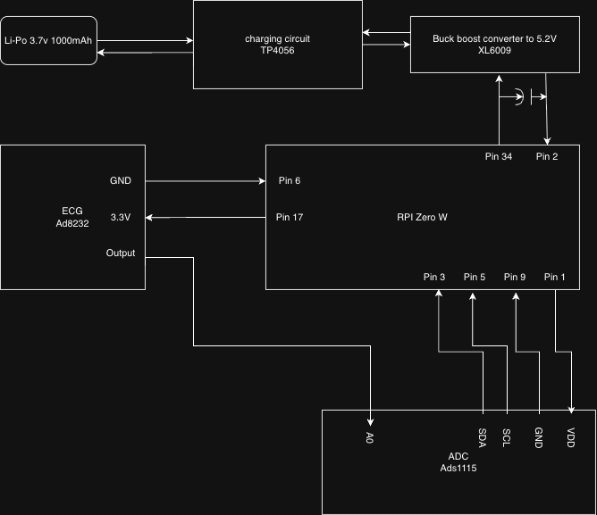

# Raspberry Pi Zero ECG Data Logger

[![Contributors][contributors-shield]][contributors-url]
[![Forks][forks-shield]][forks-url]
[![Stargazers][stars-shield]][stars-url]
[![Issues][issues-shield]][issues-url]
[![License][license-shield]][license-url]

---

## About The Project

This project allows you to read ECG data using an ADS1115 ADC connected via I²C and display it through a Flask web interface. You can also generate PDF reports with detected events.

**Features:**
- Real-time ECG data acquisition using ADS1115
- Flask web interface to visualize ECG data
- Graph plotting with Matplotlib
- PDF report generation with ReportLab
- Compatible with Raspberry Pi Zero

---

## Built With

- [Python](https://www.python.org/)
- [Flask](https://flask.palletsprojects.com/)
- [Matplotlib](https://matplotlib.org/)
- [ReportLab](https://www.reportlab.com/docs/reportlab-userguide.pdf)
- [Adafruit CircuitPython ADS1x15](https://github.com/adafruit/Adafruit_CircuitPython_ADS1x15)

---

## Getting Started

Follow these instructions to set up your Raspberry Pi Zero and run the project locally.

### Prerequisites

- Raspberry Pi Zero (W or WH recommended)
- ECG sensor (analog output)
- ADS1115 ADC module
- Python 3.11 or higher

---

## Hardware Wiring & Assembly

This project uses an **ADS1115 16-bit ADC** to convert the analog ECG signal into digital data and communicate with the Raspberry Pi Zero over **I²C**.

### Raspberry Pi Zero ↔ ADS1115 Wiring

| Raspberry Pi Zero Pin | Function | ADS1115 Pin |
|-----------------------|----------|-------------|
| Pin 1                 | 3.3V     | VDD         |
| Pin 6                 | GND      | GND         |
| Pin 3 (GPIO2)         | SDA      | SDA         |
| Pin 5 (GPIO3)         | SCL      | SCL         |

> ⚠️ The ADS1115 must be powered at **3.3V** when connected to the Raspberry Pi to ensure safe I²C logic levels.

### ECG Sensor ↔ ADS1115 Wiring

| ECG Module Pin | ADS1115 Pin |
|---------------|-------------|
| OUT / SIGNAL  | A0          |
| GND           | GND         |

- The ECG signal is read on **ADS1115 channel A0**
- Gain and sampling rate are configured in software

### Wiring Diagram



> This diagram shows the complete wiring between the Raspberry Pi Zero, ADS1115, and ECG sensor.

### Safety Notes

- This system is **not electrically isolated**
- Do **not** connect to mains-powered equipment while attached to a person
- For **educational and experimental use only**
- This is **not a medical device**

---

## Electrode Placement (Educational Use)

Correct electrode placement is critical for obtaining a clean ECG signal.  
This project typically uses a **3-electrode configuration**.

### Typical Placement

- **RA (Right Arm):** Right side of the chest or right arm
- **LA (Left Arm):** Left side of the chest or left arm
- **RL (Reference / Ground):** Lower right abdomen or leg

### Placement Diagram


**Image source:**  
https://lastminuteengineers.com/wp-content/uploads/arduino/AD8232-Module-ECG-Electrodes-Placements.png

> ⚠️ **Disclaimer:**  
> This project is for educational and experimental purposes only.  
> It is **not intended for medical diagnosis or treatment**.

---

## Installation

1. **Update your Raspberry Pi:**
    ```bash
    sudo apt update && sudo apt upgrade -y
    ```

2. **Enable I²C on Raspberry Pi Zero:**
    ```bash
    sudo raspi-config
    ```
    - Navigate to **Interface Options → I2C → Enable**
    - Reboot:
    ```bash
    sudo reboot
    ```

3. **Clone the repository:**
    ```bash
    git clone https://github.com/wernerhzigby/electrocardiograma.git
    cd electrocardiograma
    ```

4. **Enable I²C kernel modules (if needed):**
    ```bash
    sudo modprobe i2c-bcm2708
    sudo modprobe i2c-dev
    ```
    Verify I²C devices:
    ```bash
    i2cdetect -y 1
    ```

5. **Install Python dependencies:**
    ```bash
    sudo apt install python3-pip -y
    pip3 install -r requirements.txt
    ```

---

## Usage

1. Run the Flask server:
    ```bash
    python3 app.py
    ```

2. Open a browser on your Pi or another device in the same network:
    ```
    http://<raspberry-pi-ip>:5000
    ```

3. View real-time ECG graphs and generate PDF reports.

---

## Roadmap

- [x] Real-time ECG acquisition
- [x] Flask web interface
- [x] PDF report generation
- [x] Add automatic event detection flags
- [ ] Add mobile-friendly interface

---

## Contributing

Contributions are welcome! Steps:

1. Fork the project  
2. Create your feature branch (`git checkout -b feature/AmazingFeature`)  
3. Commit your changes (`git commit -m 'Add some AmazingFeature'`)  
4. Push to the branch (`git push origin feature/AmazingFeature`)  
5. Open a pull request  

---

## License

Distributed under the Unlicense License. See `LICENSE.txt` for more information.

---

## Contact

Werner Hohenfeldt Zigby – Wernerzigby@gmail.com  
Project Link: https://github.com/wernerhzigby/electrocardiograma

---

<!-- MARKDOWN LINKS & IMAGES -->
[contributors-shield]: https://img.shields.io/github/contributors/wernerhzigby/electrocardiograma.svg?style=for-the-badge
[contributors-url]: https://github.com/wernerhzigby/electrocardiograma/graphs/contributors
[forks-shield]: https://img.shields.io/github/forks/wernerhzigby/electrocardiograma.svg?style=for-the-badge
[forks-url]: https://github.com/wernerhzigby/electrocardiograma/network/members
[stars-shield]: https://img.shields.io/github/stars/wernerhzigby/electrocardiograma.svg?style=for-the-badge
[stars-url]: https://github.com/wernerhzigby/electrocardiograma/stargazers
[issues-shield]: https://img.shields.io/github/issues/wernerhzigby/electrocardiograma.svg?style=for-the-badge
[issues-url]: https://github.com/wernerhzigby/electrocardiograma/issues
[license-shield]: https://img.shields.io/github/license/wernerhzigby/electrocardiograma.svg?style=for-the-badge
[license-url]: https://github.com/wernerhzigby/electrocardiograma/blob/main/LICENSE.txt
